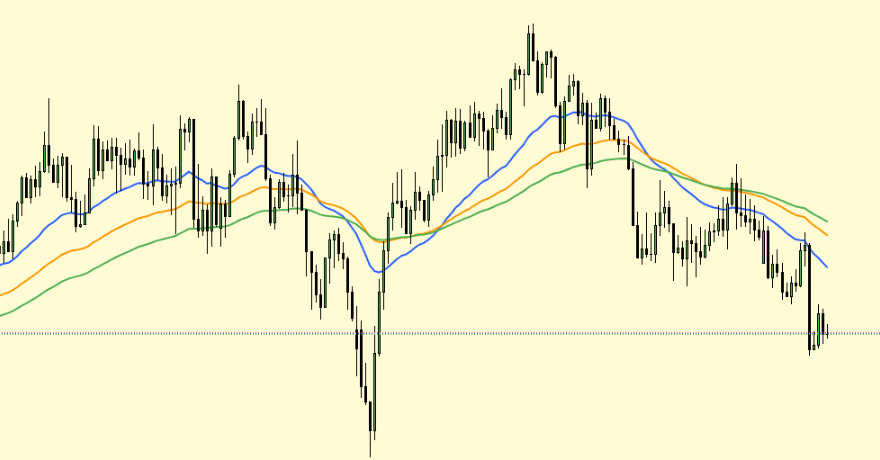
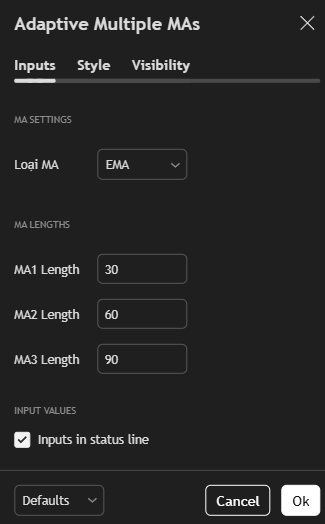

# Adaptive Multiple Moving Averages

This Pine Script indicator plots multiple moving averages (MA) on the chart with customizable length and type.  
Users can select the type of MA (SMA, EMA, WMA, VWMA) and input the length for each MA individually.

## Features

- Supports 4 types of moving averages: SMA, EMA, WMA, VWMA
- Allows user to customize the length of each MA
- Automatically adjusts MA calculations based on user inputs
- Displays 3 separate MA lines with different colors for easy distinction
- Suitable for various timeframes and trading strategies

## Inputs

| Input         | Description                              |
|---------------|----------------------------------------|
| MA Type       | Choose moving average type (SMA, EMA, WMA, VWMA) |
| MA1 Length    | Length of first moving average (default 30)      |
| MA2 Length    | Length of second moving average (default 60)     |
| MA3 Length    | Length of third moving average (default 90)      |

## How to Use

1. Open [TradingView](https://tradingview.com) chart
2. Go to Pine Editor
3. Open the `adaptive-multiple-mas.pine` script file and paste the code
4. Click "Add to Chart"
5. Adjust input parameters as desired via the indicator settings

## Preview

## Author

**Nguyễn Hùng Anh**  
Email: hung000anh@gmail.com  
GitHub: [Hung000anh](https://github.com/Hung000anh)  
LinkedIn: [profile](https://www.linkedin.com/in/h%C3%B9ng-anh-nguy%E1%BB%85n-307029302/)

## License

This project is licensed under the [Mozilla Public License 2.0](https://www.mozilla.org/MPL/2.0/).
