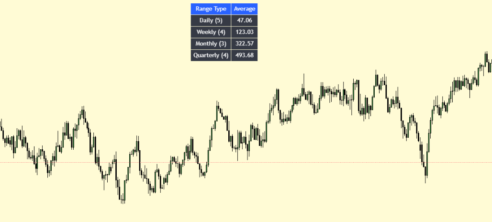
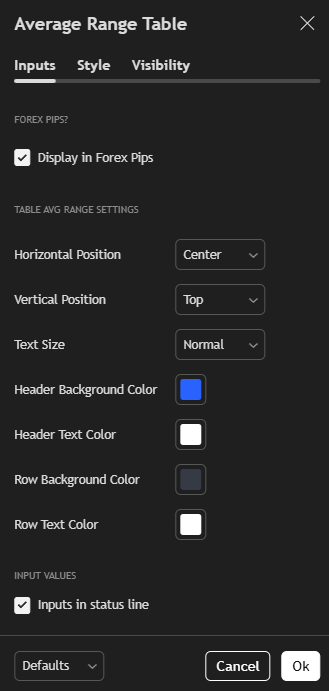

# 📊 AverageRangeTable — Pine Script Indicator

**Author**: [AnhNguyenfx](https://github.com/Hung000anh)  
**License**: Mozilla Public License 2.0  
**Platform**: [TradingView](https://tradingview.com/)  
**Version**: Pine Script v6

---

## 📌 Description

`AverageRangeTable` is a customizable Pine Script indicator for TradingView that calculates and displays the **average price range** across multiple timeframes:

- ✅ **Daily** (last 5 daily candles)  
- ✅ **Weekly** (last 4 weeks)  
- ✅ **Monthly** (last 3 months)  
- ✅ **Quarterly** (last 4 quarters)

The results are shown in a **table panel** on your chart, with options for styling and positioning.

You can use this tool for **volatility analysis**, **range forecasting**, or **comparing instruments** based on their historical range behavior.

---

## 📐 Features

- 🕒 Multi-timeframe average range: Daily, Weekly, Monthly, Quarterly  
- 📌 Option to display values in **pips** (for forex pairs) or **ticks** (for other instruments)
- 🎨 Fully customizable table:
  - Position (Top, Middle, Bottom + Left, Center, Right)
  - Font size
  - Header & Row color settings
- 🧠 Automatically adjusts to asset type and market

---

## ⚙️ Settings

| Setting | Description |
|--------|-------------|
| `Forex Pips` | Enable pip formatting for forex symbols |
| `Horizontal Position` | Left / Center / Right |
| `Vertical Position` | Top / Middle / Bottom |
| `Text Size` | Tiny → Huge |
| `Header Background/Text Color` | Styling for header row |
| `Row Background/Text Color` | Styling for range rows |

---

## 📷 Preview





## 🧠 How to Use

1. Open any chart on [TradingView](https://www.tradingview.com/)
2. Create a new script or paste the source code
3. Save and add it to the chart
4. Configure settings as needed (e.g., position, pip mode)
5. View the table showing average range values

---

## 🧮 Formula

Each average is calculated as:

```

Average Range = Sum of (High - Low) for N bars / N

```

> Where N = number of bars (5 daily, 4 weekly, etc.)

If `Forex Pips` is enabled, the result is formatted as:

```

Pips = (High - Low) / mintick / 10

```

---

## 📄 License

This project is licensed under the [Mozilla Public License 2.0](https://www.mozilla.org/MPL/2.0/).

---

## 👤 Author

**Nguyễn Hùng Anh**  
📧 Email: hung000anh@gmail.com  
🔗 GitHub: [Hung000anh](https://github.com/Hung000anh)  
🔗 LinkedIn: [LinkedIn Profile](https://www.linkedin.com/in/h%C3%B9ng-anh-nguy%E1%BB%85n-307029302/)

---

## 🚀 Coming Soon

- ATR comparison mode  
- Percent range of previous close  
- Range heatmap or trend visualization  

Feel free to fork, star 🌟, and contribute!