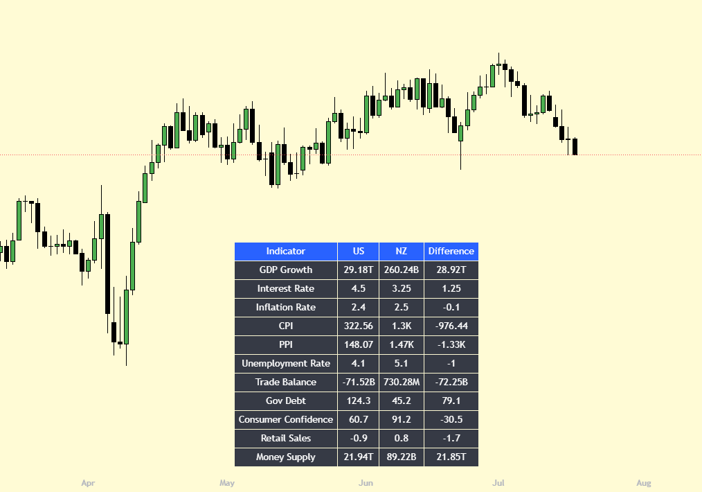
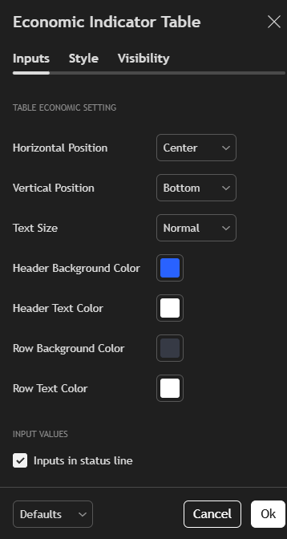

# 🌐 Economic Indicator Table for TradingView

This Pine Script displays a real-time table of key macroeconomic indicators for the **United States** and the **currency country** of the current chart's symbol (e.g., EUR for EURUSD, JPY for USDJPY, etc.).

The table includes values like GDP growth, interest rate, inflation, unemployment, money supply, and more — helping traders assess fundamental strength between countries at a glance.

---

## ✨ Features

- 📊 Compare US vs current country's economic indicators
- 📈 Pulls real-time macroeconomic data via `request.economic()`
- 🧠 Auto-detects country from currency pair (e.g. EURUSD → EU, USDJPY → JP)
- 💱 Converts trade balance & money supply to USD when needed
- 📋 Table position and style are fully customizable (position, size, colors)
- 🚫 Hides country comparison if chart is on DXY (symbol: DX1!)

---

## 🧾 Included Indicators

| Indicator              | Code  |
|------------------------|-------|
| GDP Growth             | GDP   |
| Interest Rate          | INTR  |
| Inflation Rate (YoY)   | IRYY  |
| Consumer Price Index   | CPI   |
| Producer Price Index   | PPI   |
| Unemployment Rate      | UR    |
| Trade Balance          | BOT   |
| Government Debt        | GDG   |
| Consumer Confidence    | CCI   |
| Retail Sales           | RSMM  |
| Money Supply (M2/M3)   | M2/M3 |

---

## ⚙️ Settings

| Setting              | Description                                  |
|----------------------|----------------------------------------------|
| Horizontal Position  | Left / Center / Right                        |
| Vertical Position    | Top / Middle / Bottom                        |
| Text Size            | Tiny to Huge                                 |
| Header Color         | Customize header background & text           |
| Row Color            | Customize row background & text              |

---

## 💡 How It Works

1. Script detects the active currency on your chart (e.g., USD/JPY → JP)
2. It fetches U.S. data + foreign data using `request.economic()`
3. Converts economic figures to USD where appropriate
4. Displays a 3 or 4-column table:
   - Indicator Name
   - US Value
   - Foreign Value
   - Difference (US - Foreign)

📝 If you're on `DXY` (US Dollar Index), only U.S. data is shown.

---

## 📷 Preview

---

## 📈 Recommended Use Cases

- Fundamental comparison before swing or position trades
- Macro traders analyzing economic divergence
- FX traders watching rate/inflation differentials
- Overlay it with technical tools for hybrid analysis

---

## 👨‍💻 Author

**Nguyễn Hùng Anh**  
📧 Email: hung000anh@gmail.com  
🐙 GitHub: [Hung000anh](https://github.com/Hung000anh)  
💼 LinkedIn: [Profile](https://www.linkedin.com/in/h%C3%B9ng-anh-nguy%E1%BB%85n-307029302/)

---

## 📜 License

This project is licensed under the [Mozilla Public License 2.0](https://www.mozilla.org/MPL/2.0/).
