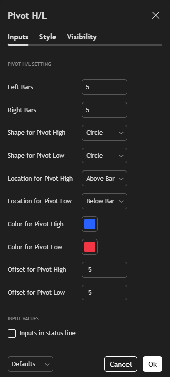

# Pivot High/Low Marker

A customizable Pine Script indicator for marking Pivot Highs and Lows on TradingView charts.  
Users can adjust left/right bar sensitivity, shape type, location, color, and offset.

## 📌 Features

- Detect Pivot Highs and Pivot Lows using `ta.pivothigh()` and `ta.pivotlow()`
- Customizable shape (circle, square, triangle, etc.)
- Set location (above/below bar)
- Adjustable offset and size
- Works on all timeframes

## ⚙️ Inputs

| Input | Description |
|-------|-------------|
| Left Bars | Number of bars to the left of pivot |
| Right Bars | Number of bars to the right of pivot |
| Shape for Pivot High/Low | Choose from Circle, Triangle, Square, etc. |
| Location for Pivot High/Low | Above or below the bar |
| Color | Set color for each pivot type |
| Offset | Move the shape up/down |

## 📸 Preview

## 📥 How to Use

1. Open TradingView chart
2. Go to Pine Editor
3. Click "New" and select "Indicator" to create a new script
4. Paste the code from [`pivot-high-low-marker.pine`](./scripts/pivot-high-low-marker.pine)
5. Click "Add to chart"
6. Customize inputs as needed

## 🧑‍💻 Author

**Nguyễn Hùng Anh**  
📧 hung000anh@gmail.com  
🔗 [GitHub](https://github.com/Hung000anh) | [LinkedIn](https://www.linkedin.com/in/h%C3%B9ng-anh-nguy%E1%85%87n-307029302/)

## 🪪 License

This project is licensed under the [Mozilla Public License 2.0](https://www.mozilla.org/MPL/2.0/).
