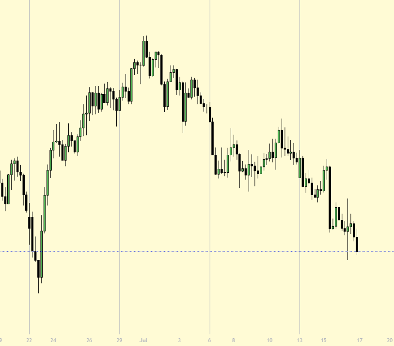
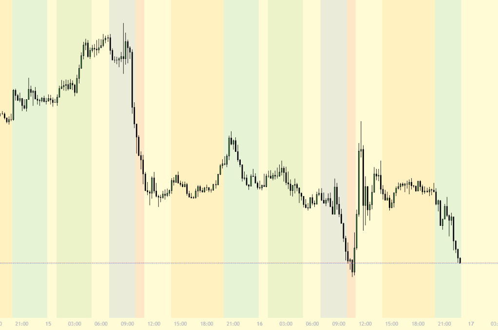
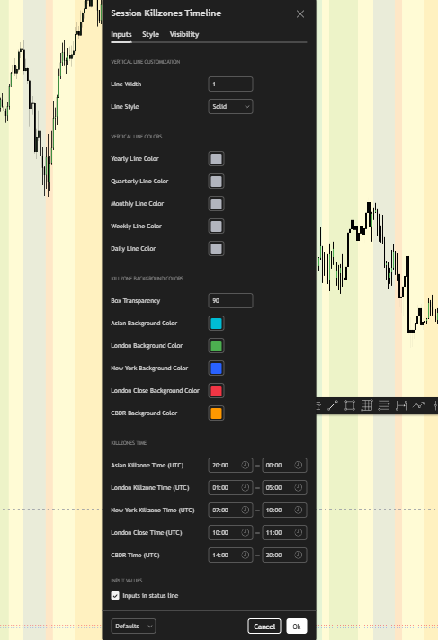

# Killzones & Vertical Time Markers

This TradingView Pine Script plots vertical lines to mark new years, quarters, months, weeks, and days depending on the chart timeframe.  
It also highlights key market session "killzones" such as Asian, London, New York, and CBDR with customizable background colors.

## ✨ Features

- Vertical lines for:
  - New Year (Monthly chart)
  - New Quarter (Weekly chart)
  - New Month (Daily chart)
  - New Week (4H chart)
  - New Day (1H chart)
- Background color boxes for:
  - Asian session
  - London session
  - New York session
  - London Close
  - CBDR
- Customizable:
  - Line width and style (solid, dashed, dotted)
  - Line and background colors
  - Killzone time ranges (UTC)

## 📥 How to Use

1. Open [TradingView](https://tradingview.com)
2. Go to Pine Editor
3. Create a new script
4. Paste the code from `session-killzones-timeline.pine`
5. Click "Add to Chart"
6. Customize settings in the indicator panel

## 🕒 Default Killzone Times (UTC)

| Session       | Time Range     |
|---------------|----------------|
| Asian         | 20:00 – 00:00  |
| London        | 01:00 – 05:00  |
| New York      | 07:00 – 10:00  |
| London Close  | 10:00 – 11:00  |
| CBDR          | 14:00 – 20:00  |

> You can edit these in the settings panel for your own timezone/strategy.

## 📷 Preview

## 🧑‍💻 Author

**Nguyễn Hùng Anh**  
Email: hung000anh@gmail.com  
GitHub: [Hung000anh](https://github.com/Hung000anh)  
LinkedIn: [profile](https://www.linkedin.com/in/h%C3%B9ng-anh-nguy%E1%BB%85n-307029302/)

## 📜 License

This project is licensed under the [Mozilla Public License 2.0](https://www.mozilla.org/MPL/2.0/).
